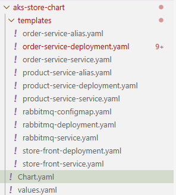

Below screenshot shows the structure of a Helm chart. 
- The `Chart.yaml` file contains metadata about the chart, such as its name, version, and description. 
  - apiVersion specifies which Helm Chart API version is being used:
    - v1 — Helm 2 (legacy, deprecated)
    - v2 — Helm 3 (current). 
      - With version 2 you can also specify dependencies on other charts, which will be automatically installed when the chart is installed.
  - version specifies the version of the chart itself, which is used for versioning and dependency management.
  - appVersion specifies the version of the application that the chart deploys. This is informational and does not affect the chart's versioning.
- The `values.yaml` file contains default configuration values for the chart, which can be overridden by users during installation. 
- The `templates/` directory contains Kubernetes manifest templates that will be rendered with the values from `values.yaml` and any user-provided overrides.

